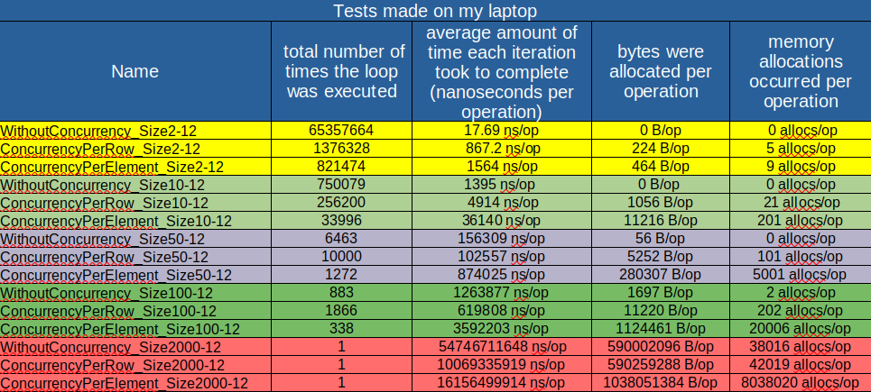
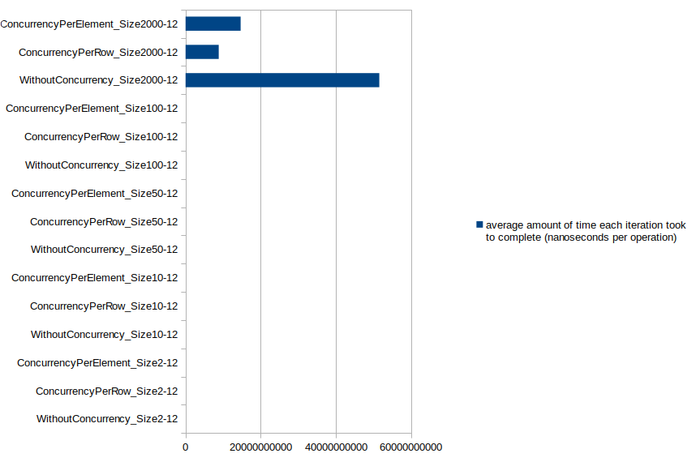
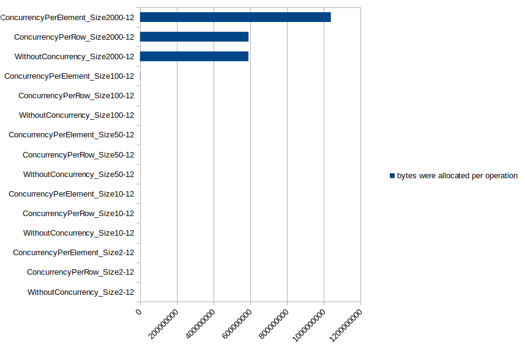
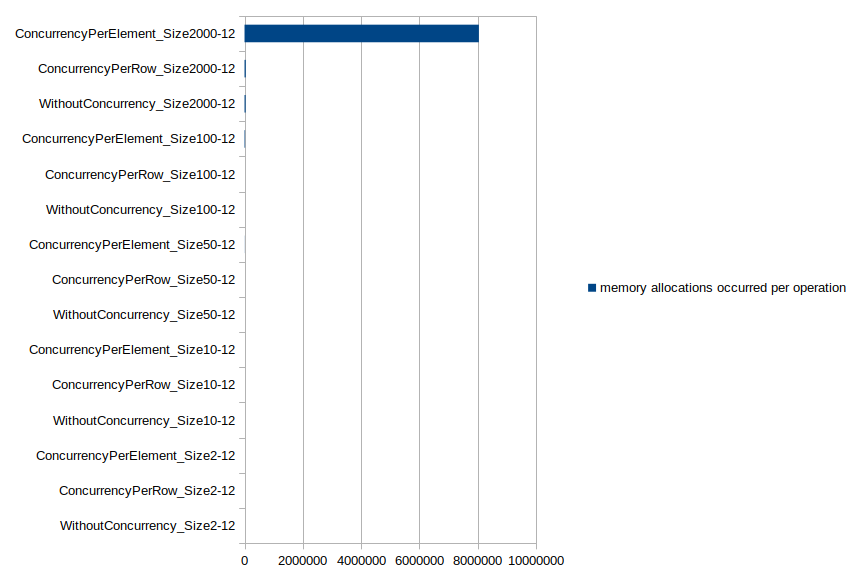

# Comparison between consecutive vs concurrent ways of multiplying matrices using [standard method of matrix multiplication](https://en.wikipedia.org/wiki/Matrix_multiplication_algorithm) O(n^3).

To run the tests:

    a-) run in the console this command: $ make full
    b-) another way is to create a docker image and run it
        build it: make docker-build
        run it: make docker-run

#### These tests ran on my laptop in two ways (within a docker container and without docker)
#### different sizes of matrices were tested: 2x2, 10x10, 50x50, 100x100 and 2000x2000
___

### Equipment characteristics 

    goos: linux
    goarch: amd64
    pkg: github.com/gonzalezlrjesus/multiply-matrices
    cpu: Intel(R) Core(TM) i7-10750H CPU @ 2.60GHz

### General results table
<table>
  <tr>
    <td>Docker Container</td>
     <td>Laptop</td>
  </tr>
  <tr>
    <td></td>
    <td></td>
  </tr>
 </table>

### Average amount of time each iteration took to complete (nanoseconds per operation)
<table>
  <tr>
    <td>Docker Container</td>
     <td>Laptop</td>
  </tr>
  <tr>
    <td></td>
    <td></td>
  </tr>
 </table>

### Bytes were allocated per operation
<table>
  <tr>
    <td>Docker Container</td>
     <td>Laptop</td>
  </tr>
  <tr>
    <td></td>
    <td></td>
  </tr>
 </table>

### Memory allocations occurred per operation
<table>
  <tr>
    <td>Docker Container</td>
     <td>Laptop</td>
  </tr>
  <tr>
    <td></td>
    <td></td>
  </tr>
 </table>

### Total number of times the loop was executed
<table>
  <tr>
    <td>Docker Container</td>
     <td>Laptop</td>
  </tr>
  <tr>
    <td></td>
    <td></td>
  </tr>
 </table>

### Analysis

 - When we work with a small amount of data it is good to use the consecutive form of multiplying because the amount of time to do the multiplication is shorter than the concurrent form, until a matrix of size less than 50 consecutive forms is the best option after of that size always better the option will be concurrency per row
 - The bytes or memory allocations per operation are so different between consecutive and concurrent forms, memory consumption is efficient by the consequitive but with a large matrix 2000 concurrency per row and consequitve become the same in different environments but concurrency per element is same only in Docker Container and running so different on my laptop
 - Go reduce the amount of time to run the loop when the size of the array grows
 - The worst way to do an matrix multiplication is by using the concurrency per element, it is the way in which it takes more time to complete the operation, more memory is used and more bytes are allocated.
 - The concurrency form takes more bytes and memory because it moves some items to the HEAP memory area
 - I used two environments to run my tests on docker container and on my laptop, both environments showed the amount of time to complete operations is similar, but something different happened with the bytes and the memory allocation had the same result in docker container
 - Reading data from a txt file, taking and storing in a temporary variable represents a considerable amount of memory used by variables, it is possible to use another way to get the data
 - I could use a different way of doing the multiplication, maybe using divide and conquer or channels etc.
 - Implementing concurrency is not always the best option for any array size, it depends on several factors such as the size of the array and how to implement concurrency is important